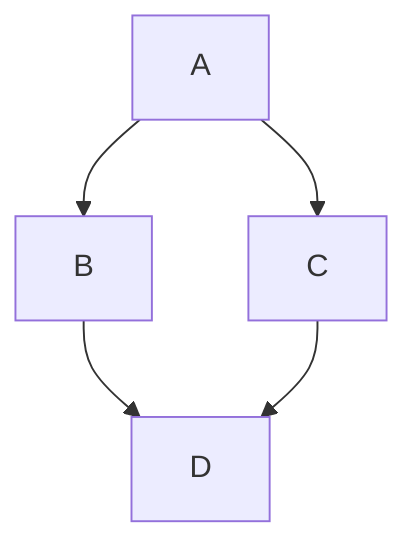
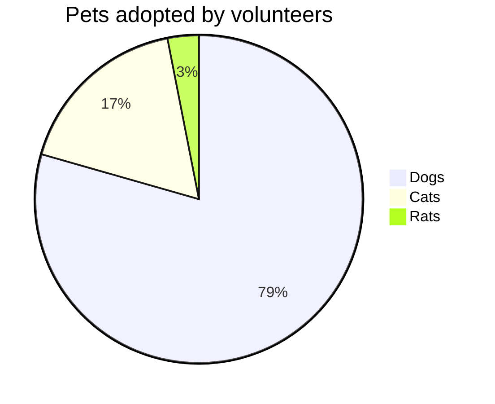

# markdown test

what is this??
I love what

## Second

### Third  

#### Create

```mermaid
graph TD;
A-->B;
A-->C;
B-->D;
C-->D;


```

```mermaid
pie title Pets adopted by volunteers
    "Dogs" : 386
    "Cats" : 85
    "Rats" : 15

```

>Todo

- [x] Todo

> 
